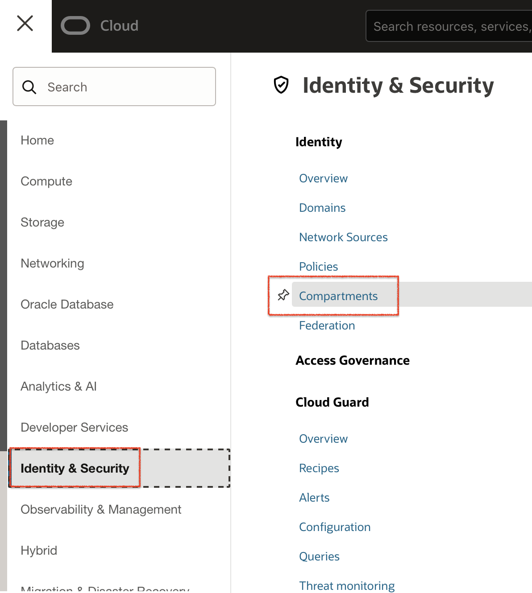
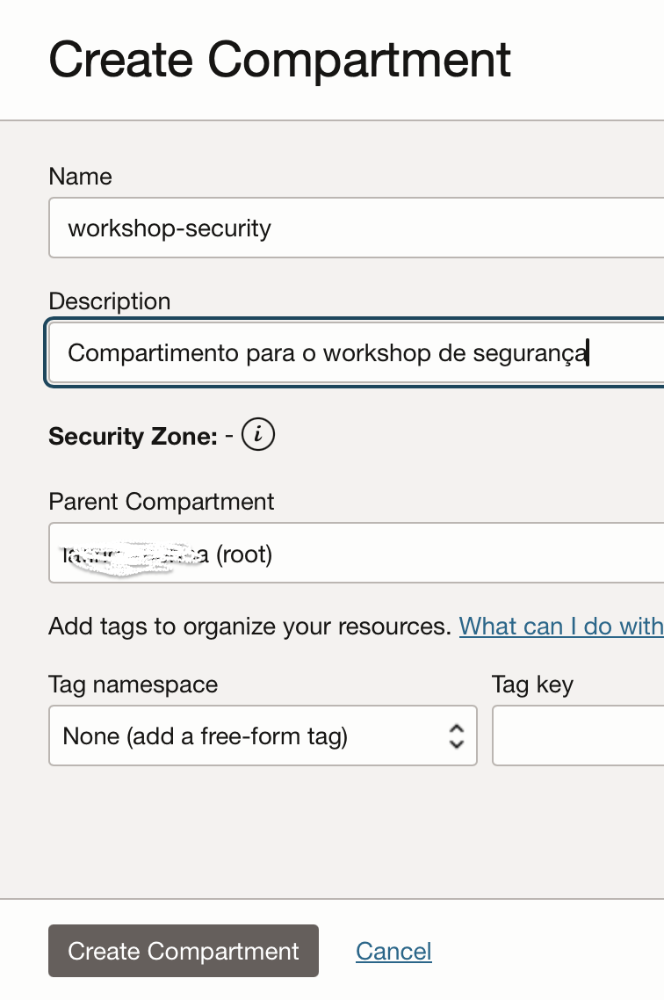

# OCI Security Lab

## <a name="overview">Introdução</a>
Neste guia, trabalharemos na disseminação e criação de diversos conceitos de segurança voltados à Oracle Cloud, seguindo diferentes processos e boas técnicas de implementação.

Exploraremos diversos recursos de segurança disponíveis na Oracle Cloud. É importante que o usuário possua um conhecimento prévio de OCI, e de preferência tenha participado de nosso workshop inicial (OCI Fast Track).

Por meio deste guia, trabalharemos com:

- Security Zones
- Bastion e Network Security Group
- Vulnerability Scanning
- Cloud Guard
- Load Balancer
- Web Application Firewall

Nosso objetivo é que, ao final deste workshop, os participantes possam ter o conhecimento na prática para implementar e manter seus ambientes na nuvem seguros.

## <a name="Tarefa 1: Deploy do ambiente básico">Tarefa 1: CTarefa 1: Deploy do ambiente básico</a>

 
*If you are logged into your OCI tenancy in the Commercial Realm (OC1), the button will take you directly to OCI Resource Manager where you can proceed to deploy. If you are not logged, the button takes you to Oracle Cloud initial page where you must enter your tenancy name and login to OCI.*
 

## <a name="Tarefa 2: Compartimentos, Security Zones e VCN">Tarefa 2: Compartimentos, Security Zones e VCN</a>

Objetivos:
- Criar um compartimento
- Criar uma Security Zone
- Realizar testes na Security Zone
- Criar uma VCN

Nesta seção, você aprenderá mais sobre os serviços listados acima.

### <a name="Tarefa 2.1: Criando um Compartimento">Tarefa 2.1: Criando um Compartimento</a>
1. No menu principal(hamburger), clique em “Identity”, escolha a opção “Compartments”

  

2. Clique em “Create Compartment” e preencha com as informações abaixo:

- **Name:** workshop-security
- **Description:** Compartimento para o workshop de segurança
- **Parent Compartment:** root

  

### <a name="Tarefa 2.2: Security Zones">Tarefa 2.2: Security Zones</a>

Uma zona de segurança está associada a um compartimento e a uma receita de zona de segurança. Quando você criar e atualizar recursos em uma zona de segurança, o Oracle Cloud Infrastructure validará essas operações com base na lista de políticas definidas na receita da zona de segurança. Se qualquer política de zona de segurança for violada, a operação será negada.
