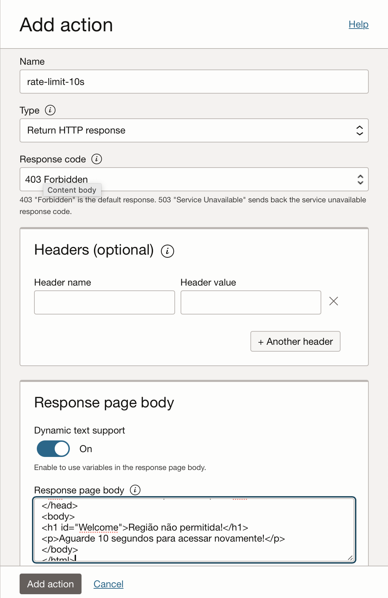
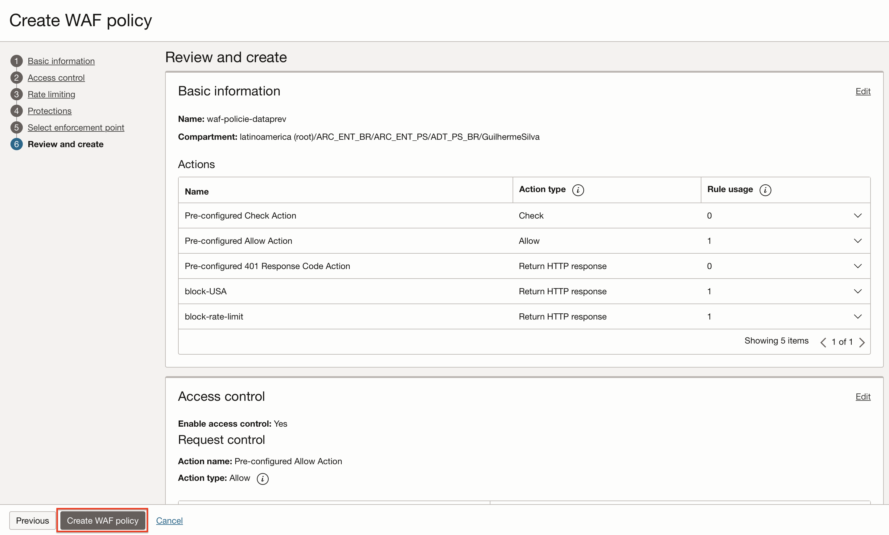
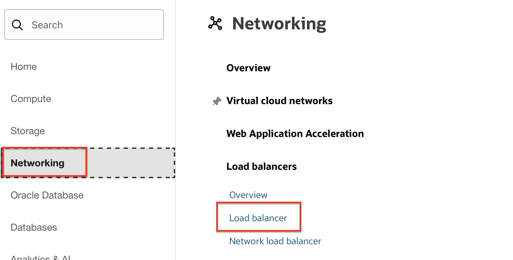
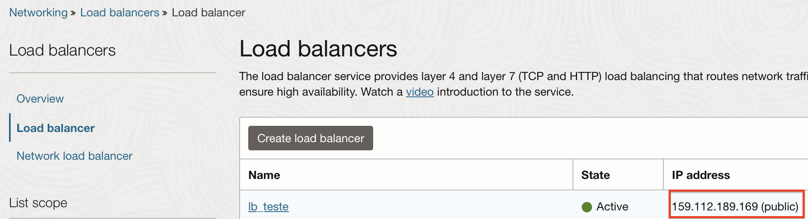

# OCI Security Lab

## <a name="overview">Introdução</a>
Neste guia, trabalharemos na disseminação e criação de diversos conceitos de segurança voltados à Oracle Cloud, seguindo diferentes processos e boas técnicas de implementação.

Exploraremos diversos recursos de segurança disponíveis na Oracle Cloud. É importante que o usuário possua um conhecimento prévio de OCI, e de preferência tenha participado de nosso workshop inicial (OCI Fast Track).

Por meio deste guia, trabalharemos com:

- Load Balancer
- Web Application Firewall

As chaves SSH para acessso as instâncias ```servidor-http01``` e ```servidor-http02```, que serão criadas neste deploy, estão no diretório ```oci-security/stack/ssh-keys```.

Nosso objetivo é que, ao final deste workshop, os participantes possam ter o conhecimento na prática para implementar e manter seus ambientes na nuvem seguros.


## <a name="Tarefa 1: Deploy do ambiente básico">Tarefa 1: Deploy do ambiente básico</a>

[](https://cloud.oracle.com/resourcemanager/stacks/create?zipUrl=https://github.com/guilhermesilvadev/oci-security/archive/refs/tags/1.0.zip)<br>
*If you are logged into your OCI tenancy in the Commercial Realm (OC1), the button will take you directly to OCI Resource Manager where you can proceed to deploy. If you are not logged, the button takes you to Oracle Cloud initial page where you must enter your tenancy name and login to OCI.*
<br>

## <a name="Laboratório 6: Web Application Firewall (WAF)  ">Laboratório 6: Web Application Firewall (WAF) </a>

O WAF é um serviço de segurança global compatível com PCI (Payment Card Industry) que protege aplicativos de tráfego malicioso e indesejado na internet.
Objetivos
- Configurar um WAF com o Load Balancer do workshop anterior
- Trabalhar com regra de Controle de Acesso
- Testar

### <a name="Tarefa 1: Criar o WAF">Tarefa 1: Criando o WAF</a>
1. Acesse o menu **Identity and Security**

2. Clique na opção **Policies**, primeira opção abaixo da sessão “Web Application Firewall”
   

3. Clique na opção **Create WAF Policy**
   

4. No passo 1, **Basic information**, preencha o campo Name com o valor **waf-policie-dataprev** e clique no botão **next** que está no final da página
   

5. No passo 2, **Access control**, marque a opção **Enable access control** e clique no botão **Add access rule**
   

6. Adicione uma regra com as configurações abaixo
      - name: block-USA
      - conditions type: Contry/Region
      - operator: In List
      - Contries: United States
      - Sessão Rule Action
          - Action name: Create new Action
            - Name: block-USA
            - Type: Return HTTP response
            - Response code: 403 Forbidden
            - Response page body: Apague o conteúdo existente e cole o conteúdo abaixo
              ``` 
              <!DOCTYPE html>
              <html>
              <head>
              <title>Região não permitida!</title>
              </head>
              <body>
              <h1 id="Welcome">Região não permitida!</h1>
              <p>Esta página não tem compatibilidade com sua região</p>
              </body>
              </html>
              ```
        - Clicar no botão **Add access rule**
        - Clique no botão **next**
   
   
   
   

7. No passo 3, **Rate limiting**, marque a opção **Enable access control** e clique no botão **Add rate limiting rule**
      - Sessão Add rate limiting rule
         - Action name: Add rate limiting rule
           - Name: rate-limit-10s
           - Condition type: Path
           - Operator: is
           - Value: /
         - Rate limiting configuration
           - Requests limit: 3
           - Period in seconds: 5
           - Action duration in seconds: 10
        
         - Rule action: create a new rule
           - Name: block-rate-limit
           - Response code: 403 Forbidden
           - Type: Return HTTP response
           - Response page body: Apague o conteúdo existente e cole o conteúdo abaixo
             ``` 
             <!DOCTYPE html>
             <html>
             <head>
             <title>Diversos acessos em pouco tempo!</title>
             </head>
             <body>
             <h1 id="Welcome">Diversos acessos em pouco tempo!</h1>
             <p>Aguarde 10 segundos para acessar novamente!</p>
             </body>
             </html>
             ```
        
      - Clicar no botão **Add action**
      - Clicar no botão **Add rate limiting rule**
      - Clique no botão **next**
8. No passo 4, **Protections**, clique em **next**
9. No passo 5, **Select enforcement point**, selecione o load balance criado no workshop anterior.
   
10. No passo 6, **Review and create**, clique no botão **Create WAF policy**
   

### <a name="Tarefa 2: Teste do WAF">Tarefa 2: Teste do WAF</a>
1. Colete o IP do seu load balancer ```Menu => Networking => Load balancers```

2. Colete o IP do seu load balancer

3. Abra o seu brower e digite a url ```http://IP_LoadBalancer``` subistituindo o IP_LoadBalancer pelo IP que foi coletado no passo 2.
4. Após o browser carregar a URL, realize o refresh da página 4 vezes, você verá a página ser bloqueada pelo WAF por ter atingido o limit.
5. Aguarde 10 segundos e realize o refresh do browser novamente, sua página será recarregada.